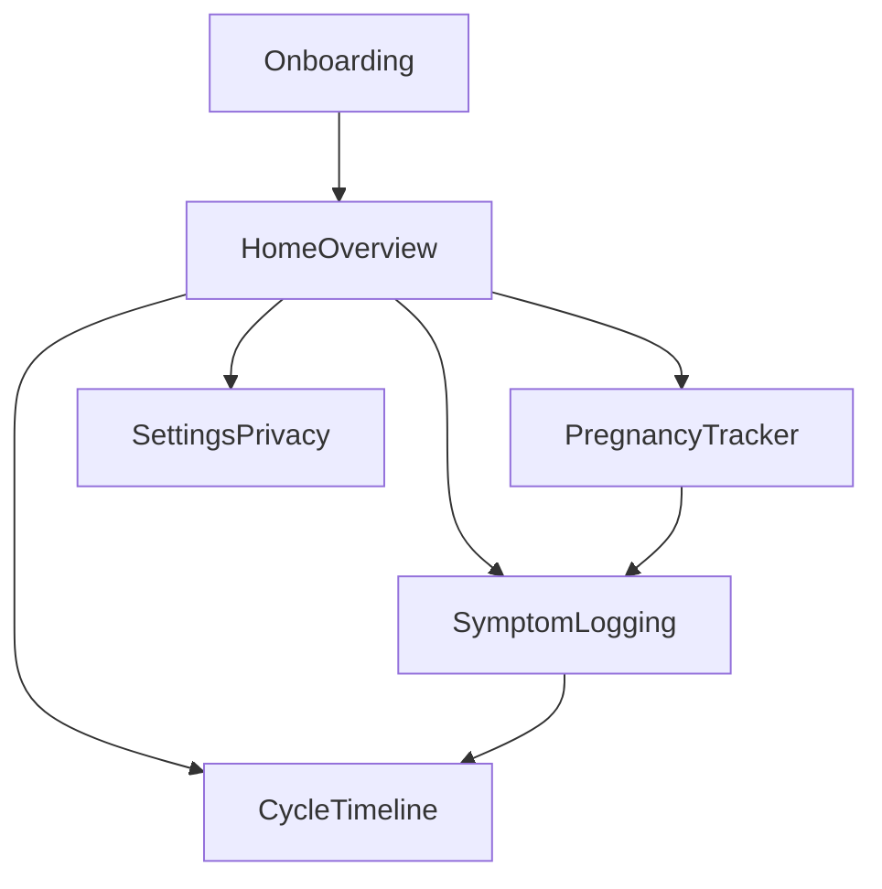

# Core User Flows (MVP)

## Navigation Model

- Bottom tabs:
  - `Timeline`
  - `Pregnancy`
  - `Symptoms`
  - `Settings`
- Home acts as the entry dashboard with quick actions.

## Flow 1: Onboarding (2-3 minutes)

1. Welcome screen
   - Message emphasizes privacy and control.
2. Mode selection
   - Trying to conceive
   - Pregnant
   - General cycle tracking
3. Basics setup
   - Last period date (optional skip)
   - Typical cycle length (optional)
   - Language preference
4. Privacy defaults card
   - Hidden notification content by default
   - Optional app lock setup (can defer)
5. Finish
   - Land on Home with first suggested action: `Log symptom`.

## Flow 2: Home Overview

- Cards:
  - Today status
  - Next milestone (period estimate or pregnancy week marker)
  - Last logged symptom summary
- Quick actions:
  - `Log symptom`
  - `Update period`
  - `Update pregnancy week`
- Calm behavior:
  - No celebratory effects
  - No urgency counters unless medically critical copy is shown

## Flow 3: Cycle Timeline

1. Open Timeline tab
2. View monthly/scroll timeline with:
   - Period windows
   - Fertile window estimate (toggle-enabled)
   - Symptom overlays
3. Correct dates
   - Edit start/end dates when cycle changes
4. Prediction confidence
   - Confidence label based on history depth
5. Export summary
   - Generate visit summary for clinician discussion

## Flow 4: Pregnancy Tracker

1. Enter Pregnancy tab
2. See current week and trimester context
3. Weekly check-in
   - mood
   - sleep
   - discomfort
   - notes
4. Milestones and reminders
   - Appointments
   - Supplements
5. Safety messaging
   - Informational guidance with clinician escalation language for urgent cases

## Flow 5: Symptom Logging

1. Start from quick action or Symptoms tab
2. Log symptom type quickly:
   - pain
   - bleeding intensity
   - mood
   - nausea
   - sleep
   - discharge
   - headaches
   - fatigue
3. Optional note and severity
4. Save and reflect
   - Timeline and pregnancy views update with linked symptom data
5. Review trends
   - Weekly/monthly pattern cards

## Information Architecture

