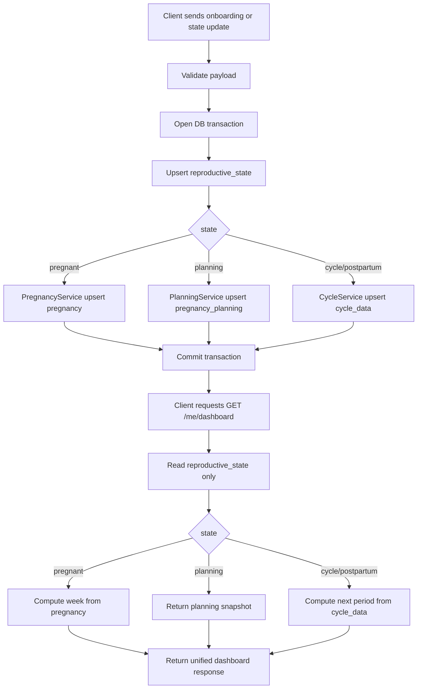

# Reproductive State Architecture Flow

This document explains how the backend should work for period tracking, pregnancy tracking, and pregnancy planning with a **single source of truth**.

## Core Principle

- `reproductive_state` is the only source of truth for current user mode.
- Dashboard data is computed, never stored.
- Domain tables store details only, not UI mode.

## State Model

Possible values:

- `cycle`
- `planning`
- `pregnant`
- `postpartum`

Backend enum:

- `CYCLE`
- `PLANNING`
- `PREGNANT`
- `POSTPARTUM`

## Data Model

- `reproductive_state` (`userId` unique, `state`, `updatedAt`, `createdAt`)
- `pregnancy` (`userId` unique, `startDate`, `endDate`, `currentWeek`, timestamps)
- `pregnancy_planning` (planning details, notes, trying timeline)
- `cycle_data` (`userId` unique, `lastPeriodDate`, `cycleLength`, timestamps)

## API Endpoints

- `POST /onboarding`
  - Initializes user state and creates/upserts required domain data.
- `GET /me/dashboard`
  - Reads `reproductive_state`, computes one unified payload for UI.
- `PATCH /me/state`
  - Changes state and syncs domain data, including transition rules.

## High-Level Flow Chart



## Transition Rules

- On state change, always update `reproductive_state` first in the same transaction.
- If transition is `pregnant -> (cycle|planning|postpartum)`:
  - close active pregnancy by setting `pregnancy.endDate`.
- Never infer current state from domain tables.
- Never duplicate mode fields in `pregnancy`, `planning`, or `cycle_data`.

## Example Dashboard Response

```json
{
  "state": "pregnant",
  "week": 5,
  "tips": [],
  "nextPeriod": null
}
```

## Operational Checklist

- For UI mode toggles, call only `PATCH /me/state`.
- For first-time setup, call `POST /onboarding`.
- For screen rendering, call only `GET /me/dashboard`.
- Do not let frontend merge multiple backend sources for mode.
- Keep all mode transitions and side effects on backend service layer.
